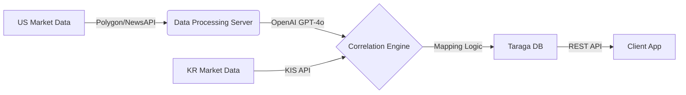

# 📈 Taraga (따라가)
>
> **"미국장이 가면, 국장도 간다."** > Wall Street의 나비효과를 Yeouido의 수익으로 연결하는 **미국-한국 증시 연동 인사이트 플랫폼**

   

## 📖 Introduction

**Taraga(따라가)**는 밤사이 열린 미국 증시(The Cause)의 데이터와 뉴스를 분석하여, 당일 한국 증시(The Effect)에서 주목해야 할 **테마와 종목을 장 시작 전에 추천**해주는 모바일 애플리케이션 서비스입니다.

정보의 홍수 속에서 단순한 뉴스 나열이 아닌, **"그래서 오늘 한국장에서는 뭘 봐야 해?"**라는 질문에 대한 명확한 해답(Action Item)을 제공하는 것을 목표로 합니다.

---

## 🚀 Key Features (핵심 기능)

### 1. 🇺🇸 US Daily Briefing (출근길 5분 요약)

- 미국 3대 지수(다우, 나스닥, S&P500) 및 공포/탐욕 지수 시각화.
- 간밤의 핵심 이슈 및 주도 섹터(Sector) AI 3줄 요약.

### 2. 🔗 The Bridge (테마 맵핑 시스템)

- **AI 연관성 분석:** 미국 특정 종목 급등 시, 상관관계가 높은 한국 종목 자동 추출.
- *Example:* `Tesla(US) +10%` ➔ **`LG Energy Solution(KR)` & `Ecopro(KR)` 강세 예상**

### 3. ⏰ Pre-market Alert (장전 알림)

- 한국 증시 개장 전(08:30), 오늘 공략해야 할 'Key Sector' 푸시 알림 발송.
- 외국인/기관 수급이 예상되는 종목 리스트업.

### 4. 📊 Real-time Dashboard

- 테마별 미국 대장주와 한국 관련주의 등락률 비교 히트맵(Heatmap) 제공.

---

## 🛠 System Architecture



---

## 🚀 Getting Started

### Prerequisites

- Python 3.9+
- Docker & Docker Compose
- Flutter SDK 3.0+
- PostgreSQL (via Docker)
- Redis (via Docker)

### Backend Setup

1. **Clone the repository**

```bash
git clone <repository-url>
cd Taraga
```

1. **Create and activate virtual environment**

```bash
python -m venv venv
source venv/bin/activate  # On macOS/Linux
# or
venv\Scripts\activate  # On Windows
```

1. **Install dependencies**

```bash
pip install -r requirements.txt
```

1. **Configure environment variables**

```bash
cp .env.example .env
# Edit .env and add your API keys:
# - POLYGON_API_KEY
# - NEWS_API_KEY
# - OPENAI_API_KEY
# - KIS_APP_KEY, KIS_APP_SECRET, KIS_ACCOUNT_NO
```

1. **Start Docker containers**

```bash
docker-compose up -d
```

1. **Initialize database and seed themes**

```bash
python seed_themes.py
```

1. **Run the FastAPI server**

```bash
python main.py
# Server will start at http://localhost:8000
# API docs available at http://localhost:8000/docs
```

### Flutter App Setup

1. **Navigate to Flutter app directory**

```bash
cd taraga_app
```

1. **Install dependencies**

```bash
flutter pub get
```

1. **Run the app**

```bash
# For iOS simulator
flutter run

# For Android emulator
flutter run

# For web
flutter run -d chrome
```

**Note:** Make sure the backend server is running at `http://localhost:8000` before starting the Flutter app.

### Testing the Integration

1. **Test the backend API**

```bash
# Check health endpoint
curl http://localhost:8000/health

# View API documentation
open http://localhost:8000/docs  # macOS
# or
xdg-open http://localhost:8000/docs  # Linux
```

2. **Run daily analysis to populate data**

```bash
python run_daily_analysis.py
```

This will:
- Fetch US market data
- Generate AI analysis
- Create theme recommendations
- Populate the database with today's briefing

3. **Test Flutter app**

Once the backend is running and has data, launch the Flutter app. It will automatically connect to `http://localhost:8000` and display:
- Daily US market briefing
- Recommended Korean themes
- Theme details

### Error Handling

The application includes comprehensive error handling:

**Backend (FastAPI):**
- Global exception handler for unhandled errors
- Database error handling with SQLAlchemy
- HTTP status codes (404 for not found, 500 for server errors)
- Structured error responses with detailed messages
- Logging for debugging and monitoring

**Flutter App:**
- API connection error detection
- User-friendly error messages
- Retry functionality
- Loading states and indicators
- Graceful handling of missing data

### Troubleshooting

**Backend Issues:**

1. **"No briefing found" error**
   - Run `python run_daily_analysis.py` to generate today's data
   - Check that Docker containers are running: `docker-compose ps`

2. **Database connection error**
   - Ensure PostgreSQL is running: `docker-compose up -d`
   - Check database credentials in `.env` file

3. **API key errors**
   - Verify all API keys are set in `.env` file
   - Check that keys are valid and have proper permissions

**Flutter App Issues:**

1. **"Backend server is not responding"**
   - Verify backend is running: `curl http://localhost:8000/health`
   - Check firewall settings
   - Ensure correct API URL in `lib/services/api_service.dart`

2. **Build errors**
   - Run `flutter pub get` to refresh dependencies
   - Try `flutter clean` then rebuild

### Production Deployment

For production deployment:

1. **Backend:**
   - Set `allow_origins` in CORS middleware to specific domains
   - Use environment-specific configuration
   - Set up proper logging and monitoring
   - Use a production-grade ASGI server (e.g., gunicorn with uvicorn workers)

2. **Flutter App:**
   - Update `baseUrl` in `ApiService` to production API URL
   - Build release versions: `flutter build apk` or `flutter build ios`
   - Test on physical devices

---

## 📡 API Endpoints

### Briefing

- `GET /api/v1/briefing/today` - Get today's market briefing

### Themes

- `GET /api/v1/themes/list` - Get all available themes
- `GET /api/v1/themes/recommendations` - Get recommended themes for today
- `GET /api/v1/themes/{theme_id}/stocks` - Get Korean stocks for a specific theme

### Market

- `GET /api/v1/market/us/top-gainers` - Get US market top gainers

---

## 📁 Project Structure

```
Taraga/
├── main.py                 # FastAPI application entry point
├── models.py              # SQLAlchemy database models
├── database.py            # Database connection handling
├── requirements.txt       # Python dependencies
├── docker-compose.yml     # Docker services configuration
├── seed_themes.py         # Database seeding script
├── run_daily_analysis.py  # Daily analysis pipeline
├── services/              # External API services
│   ├── polygon_service.py
│   ├── kis_service.py
│   ├── news_service.py
│   └── openai_service.py
├── routers/               # FastAPI route handlers
│   ├── briefing.py
│   ├── themes.py
│   └── market.py
├── logic/                 # Business logic
│   └── correlation_engine.py
└── taraga_app/            # Flutter mobile application
    └── lib/
        ├── models/        # Data models
        ├── services/      # API client
        ├── screens/       # UI screens
        └── widgets/       # Reusable components
```

---

## 🔧 Development

### Running Tests

```bash
# Backend tests
pytest

# Flutter tests
cd taraga_app
flutter test
```

### Database Management

```bash
# Reset database
docker-compose down -v
docker-compose up -d
python seed_themes.py
```

---

## 📝 License

MIT License

---

## 👥 Contributors

Built with ❤️ for Korean investors
